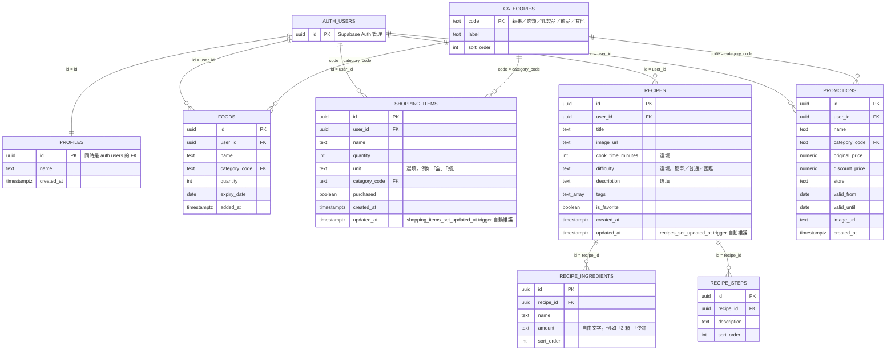
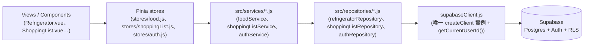

# Database 結構文件

```
supabase/
└── migrations/
    ├── 20260905000000_init_schema.sql       # v1 schema：categories／profiles／foods／shopping_items／recipes／promotions，含 RLS 政策與 handle_new_user trigger
    ├── 20260910000000_shopping_items_v2.sql # v2：shopping_items 改欄位（checked→purchased、added_at→created_at），新增 unit／category_code／updated_at（含 set_updated_at trigger）
    └── 20260910010000_recipe_details.sql    # v3：recipes 新增 cook_time_minutes／difficulty／description／updated_at（重用 set_updated_at trigger），把 ingredients(jsonb)／instructions(text) 正規化成 recipe_ingredients／recipe_steps 兩張子表（含資料搬移＋drop 舊欄位）

src/
├── repositories/
│   ├── refrigeratorRepository.js  # foods 表的 dumb CRUD：getItems／getItemById／createItem／updateItem／deleteItem
│   ├── shoppingListRepository.js  # shopping_items 表的 dumb CRUD：getItems／createItem／updateItem／deleteItem
│   ├── recipeRepository.js        # recipes／recipe_ingredients／recipe_steps 三張表的 dumb CRUD：getItems（依 created_at 排序，不含子表）／getItemById（用 Supabase FK embed 一次撈回 recipe_ingredients／recipe_steps）／createItem／createIngredients／createSteps／updateItem（沒有 deleteItem，目前不做刪除食譜）
│   └── authRepository.js          # 包 supabase.auth.* 與 profiles 單筆查詢：fetchSession／signInWithPassword／signOutSession／subscribeToAuthChanges／fetchProfileById
├── services/
│   ├── supabaseClient.js        # 唯一建立 Supabase client 的地方，讀 VITE_SUPABASE_URL／VITE_SUPABASE_ANON_KEY，並提供 getCurrentUserId()
│   ├── authService.js           # 呼叫 authRepository，組成 toUser()（session + profiles.name）回傳給 stores/auth.js
│   ├── foodService.js           # 呼叫 refrigeratorRepository，做 category_code↔category／expiry_date↔expiryDate 等欄位轉換
│   ├── shoppingListService.js   # 呼叫 shoppingListRepository，做 category_code↔category／purchased／unit／created_at↔createdAt／updated_at↔updatedAt 轉換
│   └── recipeService.js         # 呼叫 recipeRepository，做 image_url↔imageUrl／cook_time_minutes↔cookTimeMinutes／is_favorite↔isFavorite／created_at↔createdAt／updated_at↔updatedAt 轉換，並把 embed 回來的 recipe_ingredients／recipe_steps 依 sort_order 排序後映射成 ingredients／steps；insertRecipe 用 getCurrentUserId() 補 user_id，建立 recipe 後接著建立 ingredients／steps，最後 fetchRecipeById 回傳組好的完整物件
└── types/
    ├── user.js                  # User：id／email／name，對應 auth.users + profiles
    ├── food.js                  # Food：對應 foods 表
    ├── shoppingItem.js          # ShoppingItem：id／name／quantity／unit／category／purchased／createdAt／updatedAt，對應 shopping_items 表（v2 schema）
    ├── recipe.js                # Recipe：id／title／imageUrl／cookTimeMinutes／difficulty／description／tags／isFavorite／createdAt／updatedAt，對應 recipes 表；ingredients／steps 只有查詳情（fetchRecipeById）時才會有值
    ├── recipeIngredient.js      # RecipeIngredient：id／name／amount／sortOrder，對應 recipe_ingredients 表
    └── recipeStep.js            # RecipeStep：id／description／sortOrder，對應 recipe_steps 表

.env.example                     # VITE_SUPABASE_URL／VITE_SUPABASE_ANON_KEY 佔位範本，實際值放 .env（已 gitignore）
```

## 資料庫架構圖

### ER 圖（資料表關聯）



- 除 `categories` 外，每張表都有 `user_id` 指向 `auth.users` 並開 RLS，政策限制 `auth.uid() = user_id`（`profiles` 則是 `auth.uid() = id`）
- `foods`／`shopping_items`／`promotions` 三張表的 `category_code` 都是外鍵指到共用的 `categories.code`（v2 migration 把 `shopping_items` 也納入這個共用分類表）
- `recipes` 沒有跨使用者共用機制，`is_favorite` 是欄位而非關聯表
- `recipe_ingredients`／`recipe_steps` 是 `recipes` 的一對多子表，兩張表都沒有自己的 `user_id`——RLS 用 `exists (select 1 from recipes where recipes.id = recipe_ingredients.recipe_id and recipes.user_id = auth.uid())` 這種子查詢把權限跟著父表的 `user_id` 走，而不是每張子表都重複存一份 `user_id`
- `shopping_items`／`recipes` 有 `updated_at` 欄位與對應的 `set_updated_at()` trigger（兩張表共用同一個 trigger function）；其他表沒有這個機制

### 資料存取分層（元件永遠不直接呼叫 Supabase）



## 重點功能

- **Schema 分三份 migration**：`20260905000000_init_schema.sql` 定義六張表——`categories`（分類查表）、`profiles`（1:1 對應 `auth.users`，靠 `handle_new_user` trigger 自動建立）、`foods`（我的冰箱）、`shopping_items`（採買清單）、`recipes`（私有食譜，用 `is_favorite` 布林欄位取代多對多的最愛表）、`promotions`（私有的特價食材記錄）。`20260910000000_shopping_items_v2.sql` 後續改造 `shopping_items`：欄位改名（`checked`→`purchased`、`added_at`→`created_at`）、新增 `unit`／`category_code`（NOT NULL，用「先給預設值回填→轉 NOT NULL→拿掉預設值」三步驟安全遷移既有資料）／`updated_at`（配 `set_updated_at()` trigger 在每次 UPDATE 前自動寫入 `now()`）。`20260910010000_recipe_details.sql` 再改造 `recipes`：新增 `cook_time_minutes`／`difficulty`（`check` 限制在簡單／普通／困難）／`description`／`updated_at`（重用同一個 `set_updated_at()` trigger function），並把原本 `ingredients`（jsonb 字串陣列）／`instructions`（單一文字）兩欄，用「先把既有資料搬進新子表 → 再 drop 舊欄位」的安全順序，正規化成 `recipe_ingredients`／`recipe_steps` 兩張一對多子表
- **`recipe_ingredients`／`recipe_steps` 用 `sort_order` 維持順序**：兩張子表都沒有自己的時間戳或 `user_id`，純粹是 `recipes` 底下有序的子資源；新增食譜時前端陣列的索引位置就是寫入的 `sort_order`，查詢時 service 再依 `sort_order` 排序還原順序（見 `recipeService.js` 的 `toRecipe()`）
- **repositories／services 兩層分工**：`src/repositories/*.js` 是唯一直接呼叫 `supabase.from(...)`／`supabase.auth.*` 的地方，函式是 dumb CRUD（raw snake_case 進出、零欄位轉換、零商業邏輯）；`src/services/*.js` 是唯一呼叫對應 repository 的地方，負責 snake_case↔camelCase 轉換、組出 `src/types/*.js` 形狀、以及 `getCurrentUserId()` 這類跨欄位的商業邏輯（見 `.claude/skills/database/SKILL.md`）。元件與 Pinia store 都不會直接碰資料庫
- **跨 domain 動作放在 View 層，不放在 store/service**：「採買清單勾選已購買→自動加入我的冰箱」這個行為，因為 `stores/shoppingList.js` 依規定只能呼叫 `shoppingListService`，不能碰 `foodService`／`foodStore`（見 `.claude/skills/backend/SKILL.md`），所以實作在 `src/views/ShoppingList.vue` 的 `handleToggle()`：先呼叫 `shoppingListStore.togglePurchased(id)`，成功後若「勾選前是未購買」才呼叫 `useFoodStore().addFood(...)`。取消勾選不會反向刪除冰箱裡的食材（已知限制：重新勾選會再新增一筆，不做防重複）
- **Auth 已完成串接**：`authService.js` 呼叫 `authRepository.js` 的 `fetchSession`／`signInWithPassword`／`signOutSession`／`subscribeToAuthChanges`，並用 `onAuthStateChange` 讓 session 過期或在別處登出時自動同步本地狀態；登入成功後用 `fetchProfileById` 查一次 `profiles` 表把 `name` 一併帶回來，組成 `User`（`types/user.js`）回傳給 `stores/auth.js`
- **Food／採買清單已完成串接**：`foodService.js`／`shoppingListService.js` 各自呼叫對應 repository，並做 `category_code`↔`category`、`expiry_date`↔`expiryDate`、`purchased`／`unit`、`created_at`↔`createdAt`／`updated_at`↔`updatedAt` 等欄位轉換；寫入時透過 `supabaseClient.js` 的 `getCurrentUserId()` 帶上 `user_id` 以符合 RLS 的 `with check`。`stores/food.js`／`stores/shoppingList.js` 的動作都是 async，各自有 `loadFoods()`／`loadItems()` 由對應頁面在 `onMounted` 呼叫；`FoodForm.vue` 編輯模式改成用 `fetchFood(id)` 直接向資料庫查單筆，不依賴列表快取
- **食譜／最愛食譜已完成串接**：`recipeService.js` 呼叫 `recipeRepository.js`，只做 `insertRecipe`（新增，內部依序建立 recipe → recipe_ingredients → recipe_steps → 最後 `fetchRecipeById` 重新查一次回傳完整物件）／`fetchRecipes`（列表，不含子表）／`fetchRecipeById`（詳情，用 Supabase FK embed 帶出 `recipe_ingredients`／`recipe_steps`）／`updateRecipe`（用來切換 `is_favorite`），沒有刪除；`stores/recipe.js` 的 `toggleFavorite(id, currentValue)` 吃呼叫端目前的 `isFavorite` 值（不查本地快取）並回傳更新後的 Recipe，因為 `RecipeDetail.vue` 可能是直接從網址進入、`recipes` 陣列裡未必已經有這筆資料。`recipes` 沒有 `deleteItem`／刪除功能
- **環境變數**：`VITE_SUPABASE_URL`／`VITE_SUPABASE_ANON_KEY` 放本機的 `.env`（已在 `.gitignore`，不會進版控），`.env.example` 提供欄位範本供新環境設定

## 本機設定：建立測試帳號並登入

目前 app **沒有註冊頁面**（`views/Login.vue` 只有登入表單，`authService.js` 沒有 `signUp`），第一個測試帳號要先在 Supabase 後台手動建立：

1. **建立/確認 Supabase 專案**：[supabase.com/dashboard](https://supabase.com/dashboard) 建立新專案（選 region、設資料庫密碼，等佈建完成）。
2. **設定環境變數**：Project Settings → API，複製 **Project URL** 與 **anon public** key；複製一份 `.env.example` 成 `.env`，填入 `VITE_SUPABASE_URL`／`VITE_SUPABASE_ANON_KEY`。
3. **套用 schema**：Dashboard 左側 **SQL Editor** → New query，依序貼上 `supabase/migrations/` 底下三份檔案（`20260905000000_init_schema.sql` → `20260910000000_shopping_items_v2.sql` → `20260910010000_recipe_details.sql`）執行（或用 CLI：`supabase link` 後 `supabase db push` 會依檔名時間戳自動照順序套用）。沒跑完這三步的話 `auth.users` 有資料，但 `profiles`／`foods`／`shopping_items`／`recipes` 等表不存在或欄位是舊版，登入後或存取採買清單／食譜會直接報錯。
4. **手動建立使用者**：Dashboard **Authentication → Users → Add user**，輸入 Email／密碼，**勾選「Auto Confirm User」**（跳過 email 驗證信，因為專案還沒設定寄信服務）。建立後，migration 裡的 `handle_new_user` trigger 會自動在 `profiles` 表建一筆對應資料（`name` 沒填時預設用 email `@` 前面那段）。
5. **登入**：`npm run dev`，開 `/login`，用剛建立的 Email／密碼登入。

之後若要讓使用者能在 app 內自行註冊（而不是每次都要進 Supabase 後台手動加），需要新增 `/register` 頁面 + `authService.signUp()`——這是目前還沒做的部分。
