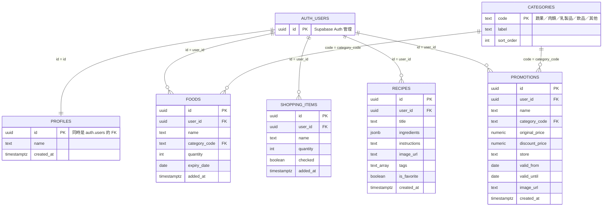
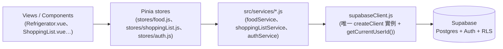

# Database 結構文件

```
supabase/
└── migrations/
    └── 20260905000000_init_schema.sql   # v1 schema：categories／profiles／foods／shopping_items／recipes／promotions，含 RLS 政策與 handle_new_user trigger

src/
├── services/
│   ├── supabaseClient.js        # 唯一建立 Supabase client 的地方，讀 VITE_SUPABASE_URL／VITE_SUPABASE_ANON_KEY
│   ├── authService.js           # 已接上真正的 Supabase Auth（signInWithPassword／signOut／getSession／onAuthStateChange）
│   ├── foodService.js           # 已接上 Supabase：fetchFoods／fetchFoodById／insertFood／updateFood／deleteFood
│   └── shoppingListService.js   # 已接上 Supabase：fetchShoppingItems／insertShoppingItem／updateShoppingItem／deleteShoppingItem
└── types/
    ├── user.js                  # User：id／email／name，對應 auth.users + profiles
    ├── food.js                  # Food：對應 foods 表
    ├── shoppingItem.js          # ShoppingItem：對應 shopping_items 表
    └── recipe.js                # Recipe：對應 recipes 表（含 isFavorite）

.env.example                     # VITE_SUPABASE_URL／VITE_SUPABASE_ANON_KEY 佔位範本，實際值放 .env（已 gitignore）
```

## 資料庫架構圖

### ER 圖（資料表關聯）



- 除 `categories` 外，每張表都有 `user_id` 指向 `auth.users` 並開 RLS，政策限制 `auth.uid() = user_id`（`profiles` 則是 `auth.uid() = id`）
- `foods`／`promotions` 各自的 `category_code` 都是外鍵指到共用的 `categories.code`
- `recipes` 沒有跨使用者共用機制，`is_favorite` 是欄位而非關聯表

### 資料存取分層（元件永遠不直接呼叫 Supabase）



## 重點功能

- **Schema**：`supabase/migrations/20260905000000_init_schema.sql` 定義六張表——`categories`（分類查表，`foods`／`promotions` 共用同一套分類）、`profiles`（1:1 對應 `auth.users`，靠 `handle_new_user` trigger 在使用者註冊時自動建立）、`foods`（我的冰箱）、`shopping_items`（採買清單）、`recipes`（私有食譜，用 `is_favorite` 布林欄位取代多對多的最愛表）、`promotions`（私有的特價食材記錄，`category_code` 對齊 `foods` 的分類）。除 `categories` 外，每張表都有 `user_id` 並啟用 RLS，政策一律限制 `auth.uid() = user_id`
- **services 分層**：只有 `src/services/*.js` 能直接呼叫 Supabase，`supabaseClient.js` 是唯一建立 client 實例的地方；其他 service 各自對應一張表，回傳的物件是 camelCase、形狀對應 `src/types/*.js`，元件與 Pinia store 不會直接碰資料庫（見 `.claude/skills/database/SKILL.md`）
- **Auth 已完成串接**：`authService.js` 改用 `supabase.auth.signInWithPassword`／`signOut`／`getSession`，並用 `onAuthStateChange` 讓 session 過期或在別處登出時自動同步本地狀態；登入成功後會再查一次 `profiles` 表把 `name` 一併帶回來，組成 `User`（`types/user.js`）回傳給 `stores/auth.js`
- **Food／採買清單已完成串接**：`foodService.js`／`shoppingListService.js` 改成直接查詢 `foods`／`shopping_items` 表，並在 service 內做 `category_code`↔`category`、`expiry_date`↔`expiryDate` 等 snake_case↔camelCase 轉換；寫入時透過 `supabaseClient.js` 的 `getCurrentUserId()` 帶上 `user_id` 以符合 RLS 的 `with check`。`stores/food.js`／`stores/shoppingList.js` 的動作也跟著改成 async，各自新增 `loadFoods()`／`loadItems()` 由對應頁面（`Refrigerator.vue`／`ShoppingList.vue`）在 `onMounted` 呼叫；`FoodForm.vue` 編輯模式改成用 `fetchFood(id)` 直接向資料庫查單筆，不再依賴列表快取，避免重新整理編輯頁時資料是空的
- **環境變數**：`VITE_SUPABASE_URL`／`VITE_SUPABASE_ANON_KEY` 放本機的 `.env`（已在 `.gitignore`，不會進版控），`.env.example` 提供欄位範本供新環境設定

## 本機設定：建立測試帳號並登入

目前 app **沒有註冊頁面**（`views/Login.vue` 只有登入表單，`authService.js` 沒有 `signUp`），第一個測試帳號要先在 Supabase 後台手動建立：

1. **建立/確認 Supabase 專案**：[supabase.com/dashboard](https://supabase.com/dashboard) 建立新專案（選 region、設資料庫密碼，等佈建完成）。
2. **設定環境變數**：Project Settings → API，複製 **Project URL** 與 **anon public** key；複製一份 `.env.example` 成 `.env`，填入 `VITE_SUPABASE_URL`／`VITE_SUPABASE_ANON_KEY`。
3. **套用 schema**：Dashboard 左側 **SQL Editor** → New query，貼上整份 `supabase/migrations/20260905000000_init_schema.sql` 執行（或用 CLI：`supabase link` 後 `supabase db push`）。沒跑這步的話 `auth.users` 有資料，但 `profiles`／`foods`／`shopping_items` 等表不存在，登入後查 profile 會直接報錯。
4. **手動建立使用者**：Dashboard **Authentication → Users → Add user**，輸入 Email／密碼，**勾選「Auto Confirm User」**（跳過 email 驗證信，因為專案還沒設定寄信服務）。建立後，migration 裡的 `handle_new_user` trigger 會自動在 `profiles` 表建一筆對應資料（`name` 沒填時預設用 email `@` 前面那段）。
5. **登入**：`npm run dev`，開 `/login`，用剛建立的 Email／密碼登入。

之後若要讓使用者能在 app 內自行註冊（而不是每次都要進 Supabase 後台手動加），需要新增 `/register` 頁面 + `authService.signUp()`——這是目前還沒做的部分。
